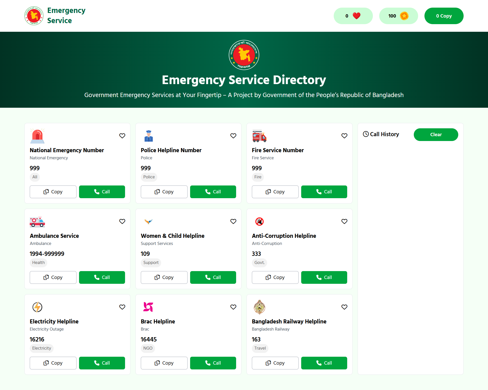

# Emergency Service Directory 🇧🇩

A clean, simple, and user-friendly web application that displays important government emergency hotline numbers for Bangladesh in one place. Users can copy hotline numbers, simulate calls, track call history, and interact with gamified counters like hearts, coins, and copy counts.


---

## 📸 Screenshot



---

## ✨ Main Features

* **Centralized Hotlines:** All major emergency numbers (Police, Fire, Ambulance, Electricity, etc.) in one card-based layout.
* **One-Click Copy:** Instantly copy hotline numbers to your clipboard.
* **Interactive Call Simulation:** A "Call Now" button that simulates dialing, deducts virtual coins, and logs the call.
* **Gamified Interaction:** Click hearts to "like" services; counters track Hearts, Coins, and Copies in real-time.
* **Call History:** A dedicated panel tracking recent simulated calls with a clear-history option.
* **Responsive Design:** Fully mobile-responsive UI built with TailwindCSS and DaisyUI.

---

## 🛠️ Technologies Used

* **HTML5** - Semantic structure.
* **TailwindCSS** (via CDN) - Utility-first styling.
* **DaisyUI** (via CDN) - Component classes.
* **Vanilla JavaScript** - Logic for counters, clipboard, and history.
* **Google Fonts** - Typography (Hind Madurai & Roboto).
* **Font Awesome** - Iconography.

---

## 📦 Dependencies

This project relies on CDNs (Content Delivery Networks). No `npm install` is required.

* **Tailwind CSS:** `https://cdn.tailwindcss.com`
* **DaisyUI:** `https://cdn.jsdelivr.net/npm/daisyui@5.0.0/dist/full.css`
* **Font Awesome:** `https://cdnjs.cloudflare.com/ajax/libs/font-awesome/6.0.0/css/all.min.css`

---

## 📁 Project Structure

```text
/project-root
├── index.html       # Main HTML structure
├── script.js        # Logic for interactions
├── assets/          # Folder for logos and icons
│   ├── logo.png
│   └── ...
└── screenshot.png   # Preview image for README
```
# 🚀 How to Run Locally

**Important:** Because modern browsers restrict access to the Clipboard API and some local file features via the `file://` protocol, it is highly recommended to run this using a **Live Server**.

The easiest way is to use **Visual Studio Code**.

### Steps:
1. Open the project folder in **Visual Studio Code**.
2. Install the **Live Server** extension if you haven't already.
3. Open `index.html`.
4. Right-click anywhere in the code and select **"Open with Live Server"**.
5. The project will automatically launch in your default browser.

---

## ⚠️ Known Issues

* **Offline Usage:** Since the CSS, Icons, and Fonts are loaded via CDN, an **active internet connection** is required for the styling to load correctly.
* **Clipboard Permissions:** Some browsers may ask for permission to write to the clipboard.

---

## 🧩 Customization

* **Add Hotlines:** Duplicate a card `div` inside `index.html` and change the details.
* **Styling:** Use standard TailwindCSS classes directly in the HTML to change colors or spacing.
